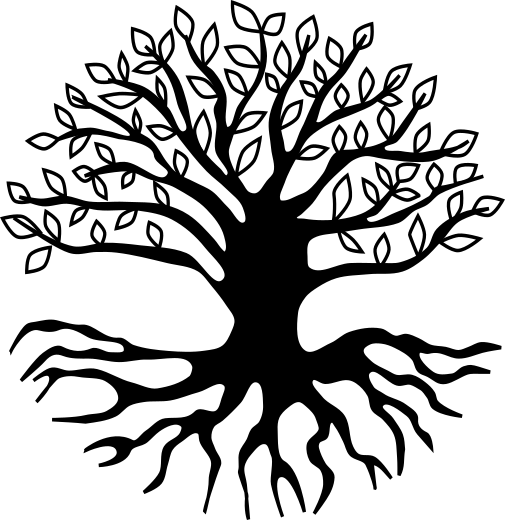
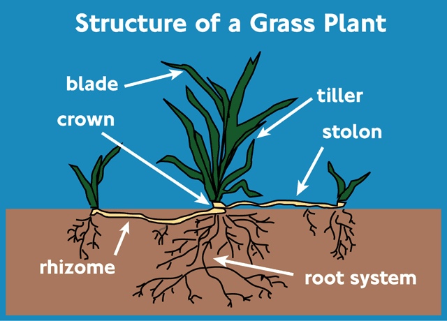

## Biology

The term rhizome comes from biology. It describes a type of root structure.

First, let's look at the root structure of a tree.

The tree is modelled as a hierarchy. Everything connects to the trunk at the centre of the tree. Each branch goes out and splits into smaller branches, and finally leaves are at the end of branches. The root structure is similar.

Plants like grass or bamboo have a rhizome structure. They do not have this central point. Here's a diagram of a grass root.

A single grass plant spreads horizontally and makes new grass shoots. These shoots are connected to each other in a rhizome, or in a rhizomatic structure.

It's possible to cut a chunk of grass out from the rhizome. This chunk will continue to grow separately. The original grass will expand to fill the empty space.

## Scale

We believe that hierarchies are approriate only at certain scales. Inspired by the work of [Geoffrey West](https://en.wikipedia.org/wiki/Geoffrey_West) and colleagues.

Most of our communication technology is modelled as a hierarchy. All 4bn devices on the internet are organised into a single address space. All domain names are organised into a single namespace.

Most of our modern world is organised into hierarchies. From our military through our corporations into our schools.

We believe that a rhizomatic approach is necessary to reach communication networks that are effective, safe, and productive at scales of billions of humans.

### CouchSurfing vs Facebook

Facebook is a rhizomatic network. Each person has a different view of the content in the network. We believe this is why Facebook has scaled to [2.45bn users].

While CouchSurfing is not a rhizomatic network. If you are a member, you can search, see, and contact all other members. In 2006 CouchSurfing was a hugely successful and growing web site. However, as the network scaled, the quality of interactions deteriorated.

Anecdotal experience suggests that in 2006 at around 100k members, CouchSurfing as a network functioned well. By 2011 over 2m users, the network was dominated by spam and related topics.

We believe the underlying dynamic here is that a single hierarchical network operates at a certain scale, and reduces its efficiency above that scale. While rhizomatic networks do not have this inherent scale issue.

Summarised, we believe that rhizomes scale better than hierarchies.

***

Photo Credits

* [Tree](https://freesvg.org/tree-with-root)
* [Grass](https://de.wikipedia.org/wiki/Datei:Grass-plant-structure.png)
